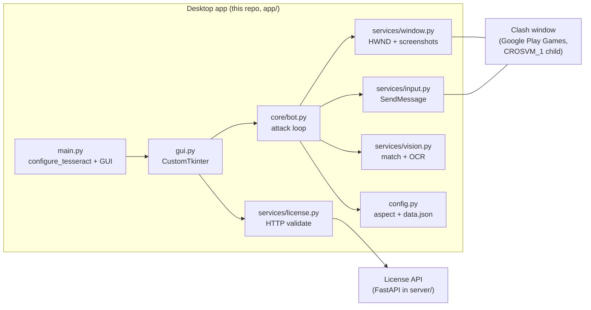

# Clash AutoLoot — developer guide

This document is for contributors and maintainers: how the Windows desktop client is structured, how it talks to the game window, and where to change behavior safely. End-user instructions stay in [`README.md`](README.md).

## Stack and constraints

- **Python 3.9+**, **Windows only** for the shipped bot (ctypes Win32 APIs, registry-backed license fingerprint).
- **GUI**: CustomTkinter (`app/ui/gui.py`).
- **Vision**: OpenCV template matching + optional **Tesseract** OCR (`pytesseract`), wired in `app/services/vision.py`; entry configures Tesseract via `app/utils/tesseract_env.py` before the GUI loads (`app/main.py`).
- **Input**: Synthetic mouse messages to the game HWND (`SendMessage`), not global cursor injection (`app/services/input.py`).
- **Packaging**: PyInstaller (`ClashAutoLoot.spec`, `build_assets/README.md`).

Dependencies are listed in `requirements.txt` (OpenCV, NumPy, Pillow, pytesseract, CustomTkinter, requests, etc.).

## High-level architecture

The **game** is assumed to run inside **Google Play Games on PC**: a top-level window whose class name starts with `HwndWrapper`, title containing “Clash of Clans”, with a descendant HWND of class `CROSVM_1`. `WindowService` resolves that child and uses it for captures and message targets (`app/services/window.py`). Other hosts are deliberately skipped so random Chromium windows do not match.

## Entry point and threading

1. `python -m app.main` inserts the repo root on `sys.path`, calls `configure_tesseract()`, then `run_gui()`.
2. `AutoLootApp` constructs a single `Bot` instance and starts **license / trial** background logic on the Tk main thread (`app/ui/gui.py`).
3. When the user presses Start, the GUI validates aspect ratio (`check_game_window_aspect_for_start` in `app/config.py`), then runs `Bot.start(...)` on a **worker thread** (`threading.Thread`). The GUI communicates status and loot totals via callbacks into Tk-safe `after()` updates.

Stopping sets `Bot.stop()` → `threading.Event`, which strategies and input loops poll (`InterruptedError` / early exits).

## Configuration: aspects and `data.json`

Templates and coordinates are maintained **per aspect ratio**, not per arbitrary resolution:

- **`templates/16_9/`** — baseline **2560×1440**.
- **`templates/16_10/`** — baseline **2560×1600**.

`resolve_aspect_key()` picks `16_9` vs `16_10` from the **outer** window pixel size within a small tolerance (`app/config.py`). `Config` is a **singleton**: it loads `templates/<aspect>/data.json`, keeps reference width/height, and **scales** points and scalars when the captured frame size differs from the baseline (`get_point`, `scale_point`, `set_target_size_from_frame`, etc.).

**Practical rule:** when adding or moving a UI coordinate, edit the JSON at the baseline resolution for that aspect folder, not the live window size.

## Vision pipeline

`VisionService` (`app/services/vision.py`) is the main image layer:

- **Template matching** via OpenCV over full frames or ROIs (e.g. bottom half for battle bar, top for builder portraits). Template filenames correspond to PNGs under `templates/<aspect>/`.
- **OCR** for text that is unreliable to template (multi-run player names, wall search, HUD numbers). Functions build ROIs, preprocess (thresholding, upscaling for small digits), call Tesseract where available, and map boxes back to screen coordinates.
- **Loot HUD**: grouped digit extraction and parsing into `(gold, elixir, dark_elixir)` for session tracking; the bot diffs consecutive snapshots and only adds **non-negative** deltas to session totals to avoid OCR glitches (`Bot._loot_snapshot_before_attack` in `app/core/bot.py`).

If Tesseract is missing or misconfigured, behavior depends on the code path: multi-run and some features log errors or degrade gracefully; see `tesseract_env` and GUI error counters.

## Input model

`InputService` sends **WM_LBUTTONDOWN / WM_LBUTTONUP / WM_MOUSEMOVE / WM_MOUSEWHEEL** to the game HWND. Coordinates are **clamped** to the same outer rect used for screenshots so clicks stay inside the capture (`_clamp_to_capture`). “Human” drags use Bezier-style interpolation with jitter (`human_move`).

This design targets the emulated game surface; it is not a general desktop automation layer.

## Bot loop (conceptual)

`Bot.start` optionally iterates **multi-run** players (account switch via OCR/name matching), then for each session runs `_run_loop`:

- Optional **wall upgrades** when storages are full (vision-driven checks, loot snapshot ordering to keep economics consistent).
- **Find match → attack → end battle → return home → home recovery** (`_find_match_and_attack`, `_return_home`, `_home_screen_recovery`).
- **Star bonus** mode exits when star UI templates no longer indicate an unclaimed bonus.
- **Ranked fill** branches use different templates/confirm flows.
- Between cycles, small scroll jitter on home mimics user behavior.

Troop deployment is delegated to **strategies** (`app/core/strategies.py`): subclasses implement `execute` for Valkyries, Sneaky Goblins, Super Minions, hero deployment, earthquakes, etc., using `Config` points (corners, paths) plus live template positions.

## Licensing and backend

**Client** (`app/services/license.py`, `app/services/trial.py`):

- Builds a stable **machine fingerprint** (registry / hardware-derived) and POSTs to a public **validate** URL with the license key and bot version.
- `LicenseManager` maintains a state machine (valid, invalid, retrying, unreachable, etc.) and periodic revalidation.

**Server** (`server/`): FastAPI app with Stripe webhooks, Postgres RPCs, rate limiting — deployable separately from the desktop app. The desktop client only needs the HTTP contract documented in that package (validate, trial heartbeat, etc.). Local server development is not required to work on vision or bot logic if you stub or ignore license in a private branch (be careful not to ship that).

## Paths, logs, and user data

- **Read-only assets** (templates) resolve through `get_resource_path()` — PyInstaller `sys._MEIPASS` when frozen, else repo root (`app/utils/common.py`).
- **Writable data**: `%LOCALAPPDATA%\ClashAutoLoot\` (log rotation, license storage, etc.). Log file path: `get_autoloot_log_path()`.

Multi-run **player list** for the frozen EXE is stored next to the executable (`README.md`); in dev, paths follow the store implementation in `app/utils/player_list_store.py`.

## Scripts and debugging

The `scripts/` folder holds one-off tools: window listing, OCR dumps, path previews, corner recording, etc. They are useful when tuning templates or `data.json`.

Debug images (e.g. HUD crops, match overlays) may be written under `glyph_debug/` when enabled in vision/bot code — useful for OCR template tuning.

## Build notes

- See [`build_assets/README.md`](build_assets/README.md) for bundling Tesseract and PyInstaller flags.
- Without a bundled Tesseract, set `TESSERACT_CMD` or install Tesseract on the machine for OCR-dependent features.

## Related files (quick index)

| Area | Primary modules |
|------|----------------|
| Attack flow | `app/core/bot.py`, `app/core/strategies.py` |
| Screen + HWND | `app/services/window.py` |
| Clicks / moves | `app/services/input.py` |
| CV + OCR | `app/services/vision.py` |
| Coordinates / aspects | `app/config.py`, `templates/*/data.json` |
| UI | `app/ui/gui.py`, `app/ui/dialogs.py`, `app/ui/widgets.py`, `app/ui/theme.py` |
| License | `app/services/license.py`, `server/app.py` |
| Taskbar thumbnail controls | `app/services/taskbar_thumb.py` |

## Disclaimer

Automating games may violate publisher terms of service. This codebase is maintained for technical education; production use is at your own risk.
