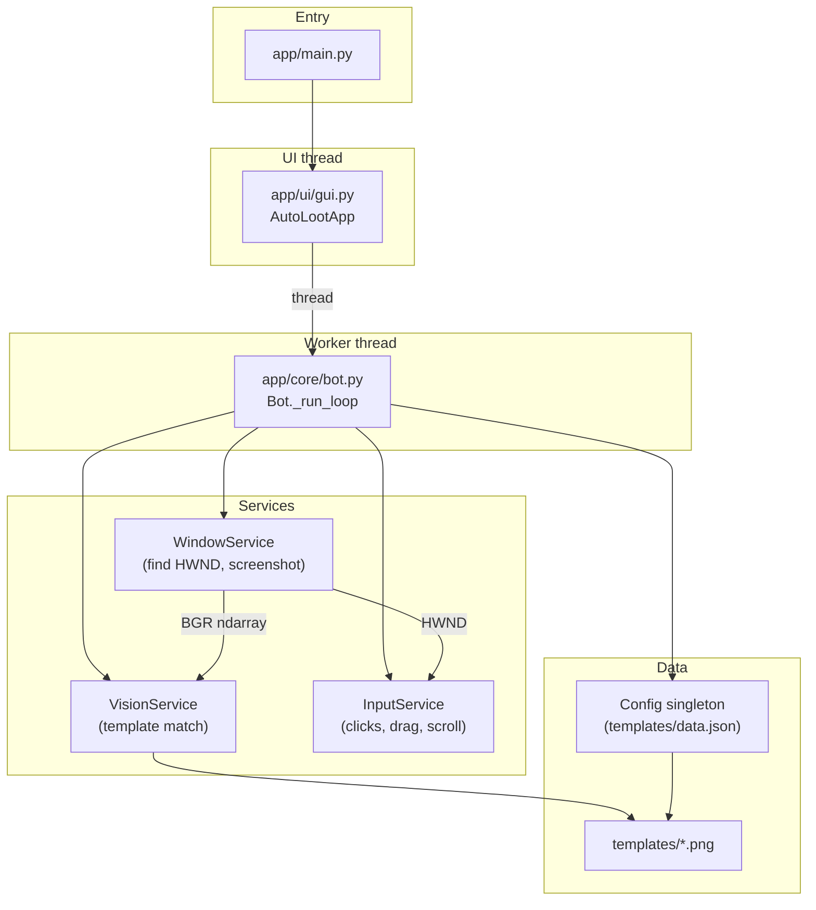

# Clash AutoLoot — Architecture

This document describes how the project is structured, how control flows at runtime, and how the major pieces fit together. After reading it, you should understand what each package does, how the bot loop works, and where to change behavior.

## Purpose

**Clash AutoLoot** is a Windows desktop helper for *Clash of Clans* (PC client). It:

1. Finds the game window and captures screenshots of it.
2. Locates UI elements via **template matching** (OpenCV).
3. Sends **mouse input** to the game window via the Windows API (`SendMessage`), not global cursor movement.
4. Repeats an **attack cycle**: home → Attack → Find Match → deploy troops → end battle → return home.

The app ships with a **CustomTkinter** GUI. The bot runs on a **background thread** so the UI stays responsive; a **stop event** lets the user abort quickly.

---

## High-level diagram

---

## Directory layout (logical)

| Path | Role |
|------|------|
| `app/main.py` | Entry: fixes `sys.path`, configures logging, starts the GUI. |
| `app/config.py` | Singleton: loads `templates/data.json`, picks a resolution profile. |
| `app/core/bot.py` | Orchestrates the farming loop and navigation between screens. |
| `app/core/strategies.py` | Attack strategies: troop selection, drag-deploy path, heroes, spells. |
| `app/services/window.py` | Win32: find window (GPG: `HwndWrapper*` + child `CROSVM_1`, title match), `PrintWindow` capture. |
| `app/services/vision.py` | OpenCV template matching, optional ROI (bottom half), helpers for color. |
| `app/services/input.py` | Win32 `SendMessage`: clicks, mouse down/up, Bezier “human” moves, wheel. |
| `app/services/taskbar_thumb.py` | Optional: taskbar thumbnail Start/Stop (Windows + COM). |
| `app/ui/gui.py` | CustomTkinter: method, duration, star bonus; starts/stops bot thread. |
| `app/utils/common.py` | `get_resource_path` for dev vs PyInstaller (`sys._MEIPASS`). |
| `app/utils/logger.py` | Shared loggers (console + rotating `autoloot.log`; default level ERROR). |
| `templates/` | `data.json` (coordinates per resolution) + PNG templates for vision. |

---

## Runtime model

### Entry point

`python -m app.main` runs `main()`:

- Inserts the **project root** into `sys.path` so `import app` works regardless of cwd.
- Calls `freeze_support()` for frozen (PyInstaller) builds.
- `setup_logger("Main")` then `run_gui()` from `app.ui.gui`.

### Threading

- The **Tk main loop** runs on the main thread (`AutoLootApp.mainloop()`).
- **Start** spawns a **daemon** `threading.Thread` that calls `Bot.start(...)`.
- **Stop** sets `Bot.stop()` → `threading.Event.set()`. The bot and `InputService.human_move` poll this event so deployment can exit promptly.
- GUI updates from the bot (status text) use `tk.after(0, ...)` so callbacks run on the UI thread.

### Configuration loading

`Config` is a **singleton** (`Config()` always returns the same instance):

1. Reads `templates/data.json` via `get_resource_path`.
2. Reads **primary monitor size** with `pyautogui.size()`.
3. If size is exactly **1920×1080**, uses `data.json[1]`; otherwise uses **`data.json[0]`** (documented as the 2560×1600 profile).

Keys are accessed with `config.get(key)` or `config.get_point(key)` (raises if missing). Strategies also use `config.data` for corner coordinates and optional values like `earthquake` offset.

---

## Service layer (detail)

### WindowService (`app/services/window.py`)

- **Window discovery**: Enumerates visible top-level windows. It uses the first match where the title contains `"Clash of Clans"` (case-insensitive), the **top-level class name** starts with `HwndWrapper` (Google Play Games shell), and a **descendant** exists whose **class name** is `CROSVM_1`. It returns that child HWND only (no fallback to the top-level window). Chromium hosts (Chrome, Discord, …) are skipped because they are not `HwndWrapper`.
- **DPI**: Tries `SetProcessDpiAwareness(2)` (per-monitor), falls back to `SetProcessDPIAware`.
- **Screenshot**: `GetWindowRect` → `PrintWindow` with `PW_RENDERFULLCONTENT` → DIB bits → PIL → NumPy BGR for OpenCV. Returns `None` if the window is missing or invalid.

The bot calls `find_window()` again at the **start of each run** so a closed/reopened game gets a new HWND.

### VisionService (`app/services/vision.py`)

- Loads templates from `templates/<name>.png` using `get_resource_path`.
- **Matching**: `cv2.matchTemplate` with `TM_CCOEFF_NORMED`; default match threshold **0.8** in `find_template`.
- **ROI**: `bottom_half_region()` returns `(x, y, w, h)` for the lower half of the frame. A fixed set `BOTTOM_HALF_BOT_TEMPLATES` (attack, find match, find, surrender, end battle, etc.) is searched only in that ROI when `_wait_for_image` runs, reducing false positives and cost.
- **Star bonus**: `find_template_with_confidence` exposes the raw score; the bot compares `emptystar.png` against threshold **0.75** to decide if the empty star is still visible.
- Additional utilities: `find_all_templates` (with optional grayscale + morphology path), HSV color fraction / leftmost pixel — available for future or experimental logic.

### InputService (`app/services/input.py`)

- All coordinates are **client-relative** messages sent with `SendMessageW` to the game `hwnd`:
  - `WM_LBUTTONDOWN` / `WM_LBUTTONUP` for clicks and drag.
  - `WM_MOUSEMOVE` with `MK_LBUTTON` while dragging.
  - `WM_MOUSEWHEEL` for scroll bursts.
- **click()** optionally jitters position (±15 px) and randomizes pause time.
- **human_move()** implements a quadratic Bezier with cosine easing; checks `stop_event` each step (~5 ms) so Stop is responsive mid-drag.

---

## Core bot loop (`app/core/bot.py`)

`Bot.start(method, run_time_minutes, star_bonus, status_callback)`:

1. Ensures the window exists (`find_window()` or error).
2. Clears `stop_event`, sets `running`.
3. Computes duration:
   - **Star bonus**: `duration = 900` seconds (15 minutes hard cap); loop can exit earlier when the empty-star template disappears.
   - **Timed**: `run_time_minutes * 60`.

### `_run_loop` sequence (each iteration)

1. **`_find_match_and_attack`**:
   - Wait for and click `attack.png` → `farmbattle.png` → optionally `attack2.png`.
   - Wait for `find.png` (Next / search UI) up to 30s.
   - Grab one screenshot, build a **`TroopSpamStrategy`** from `method` (see below), call `strategy.execute`.
   - **`_wait_for_battle_end`**: Sneaky Goblins favor surrender; others wait for end battle, with fallbacks.
   - Returns a flag: **True** means “troop not found” → main loop **breaks** after cleanup.
2. **`_return_home`**: `okay.png`; then `returnhome.png` or **chest** flow (`chestclaim.png` → taps → `chestcontinue.png`).
3. **`_home_screen_recovery`**: Up to 15 attempts — dismiss `okay.png` if present; else if **`builder.png`** appears in the **top-half ROI**, consider home.
4. Light scroll on home; if **star bonus** mode, **`_is_star_bonus_claimed`** (no strong match on `emptystar.png`) → break.

### Method IDs (GUI → bot)

| GUI label | ID | Strategy |
|-----------|----|----------|
| Sneaky Goblins | 1 | `TroopSpamStrategy(..., "sneaky", 15)` |
| Super Minions | 2 | `TroopSpamStrategy(..., "superminion", 3.1)` |
| Valkyries | 3 | `TroopSpamStrategy(..., "valkyrie", 5.5)` |

Invalid IDs default to Sneaky. Template files expected include `sneaky.png`, `superminion.png`, `valkyrie.png` (plus shared UI templates).

---

## Strategies (`app/core/strategies.py`)

### `AttackStrategy` (base)

- Holds references to `InputService`, `VisionService`, `Config`, and optional `stop_event`.
- Defines corner order `left`, `top`, `right`, `bottom` using coordinates from `data.json` (`left`, `top`, `right`, `bottom` keys).
- **`TroopSpamStrategy.execute`** (main implementation):
  1. Find `{troop_name}.png` in bottom half; if missing, log warning, optional `status_callback` to GUI, return `False` (bot stops after cycle).
  2. Click troop; **mouse down** at a randomized start corner; drag along a **closed loop** of corners (random start among top/right/left, random CW/CCW); segment duration is total strategy duration divided across legs; **mouse up** in `finally`.
  3. Fresh screenshot: **`deploy_heroes`** — optional Log Launcher, then shuffled hero bar icons (`queen`, `warden`, `RC`, `king`, `prince`), deploy along random line between config corners; second pass clicks hero icons to trigger abilities.
  4. Another screenshot: **`deploy_spells`** — if `earthquake.png` found, click three corners with configurable `earthquake` offset from config.

Legacy helpers like `_troop_spam_helper` exist on the base class but the active path is the loop in `TroopSpamStrategy.execute`.

---

## GUI (`app/ui/gui.py`)

- **CustomTkinter** dark theme; non-resizable window, centered on screen.
- **Attack method**: segmented control mapped via `ATTACK_MAP` to method IDs.
- **Star Bonus**: disables duration entry and presets; thread calls `Bot.start(..., star_bonus=True)` with a dummy `run_time_minutes` of 5 (actual cap is 900s inside the bot).
- **Start** validates minutes (1–999) when not in star bonus mode.
- **TaskbarThumb** (Windows): if import succeeds, after 500 ms registers thumbnail toolbar buttons that delegate to the same start/stop handlers; button enabled state tracks “running”.

---

## Assets and paths

### `templates/data.json`

JSON **array of two objects**: index `0` = default (2560×1600 profile), index `1` = 1920×1080. Each object holds named **pixel coordinates** used by the bot and strategies (`left`, `top`, `right`, `bottom`, `empty`, hero bar keys, `earthquake` offset, etc.). Some keys in the file are **legacy** relative to the current Python bot (e.g. older attack/find_match naming); the running code primarily uses **template-driven** clicks for navigation plus **corner keys** for deployment.

### `templates/*.png`

One PNG per template name referenced in code (`attack.png`, `farmbattle.png`, `okay.png`, troop/hero/spell icons, etc.). Captures must match **game scale and theme** for the configured resolution profile.

### `get_resource_path` (`app/utils/common.py`)

- **Development**: resolves paths relative to the repo root (three levels above `common.py`).
- **PyInstaller**: uses `sys._MEIPASS` so bundled `templates` are found when using `--add-data` (see README).

---

## Logging (`app/utils/logger.py`)

- Each module calls `setup_logger("Name")`.
- Handlers attach only once per logger name (re-import safe).
- Default level is **ERROR**; INFO logs from `Config` / `BotCore` appear only if the level is lowered in code or via logging configuration.
- Rotating file **`autoloot.log`** in the process cwd (5 MB × 3 backups).

---

## Dependencies (`requirements.txt`)

| Package | Use |
|---------|-----|
| opencv-python | Template matching, image ops |
| numpy | Arrays for OpenCV and window capture |
| pillow | Image I/O in window capture and taskbar icons |
| pyautogui | **Screen size only** (`Config.load_config`) |
| customtkinter | GUI |
| pyinstaller | Optional frozen builds |
| keyboard | Listed in requirements; not imported by `app/` |

---

## Extension points and caveats

1. **New resolution**: Add a profile to `data.json` and extend `Config.load_config` selection logic (today only 1920×1080 vs default).
2. **New strategy**: Subclass `AttackStrategy` or mirror `TroopSpamStrategy`; wire `Bot._get_strategy`.
3. **New UI step**: Add template PNG, call `_wait_for_image` or `VisionService.find_template` from `Bot`.
4. **Emulators other than CROSVM**: May need different `child_class` or title matching in `WindowService`.
5. **Terms of service**: Automation may violate game ToS; this is educational software (see README disclaimer).

---

## Quick reference: one attack cycle (ordered)

1. Click Attack → Find Match → optional second Attack.
2. Wait for match / Next UI (`find.png`).
3. Screenshot → troop strategy (drag loop, heroes, spells).
4. End battle (surrender / end battle).
5. Okay → Return Home.
6. Home recovery (Okay popups + Attack visible).
7. Scroll; star bonus check if enabled.

This matches the implementation in `Bot._run_loop`, `_find_match_and_attack`, `_return_home`, and `_home_screen_recovery`.
